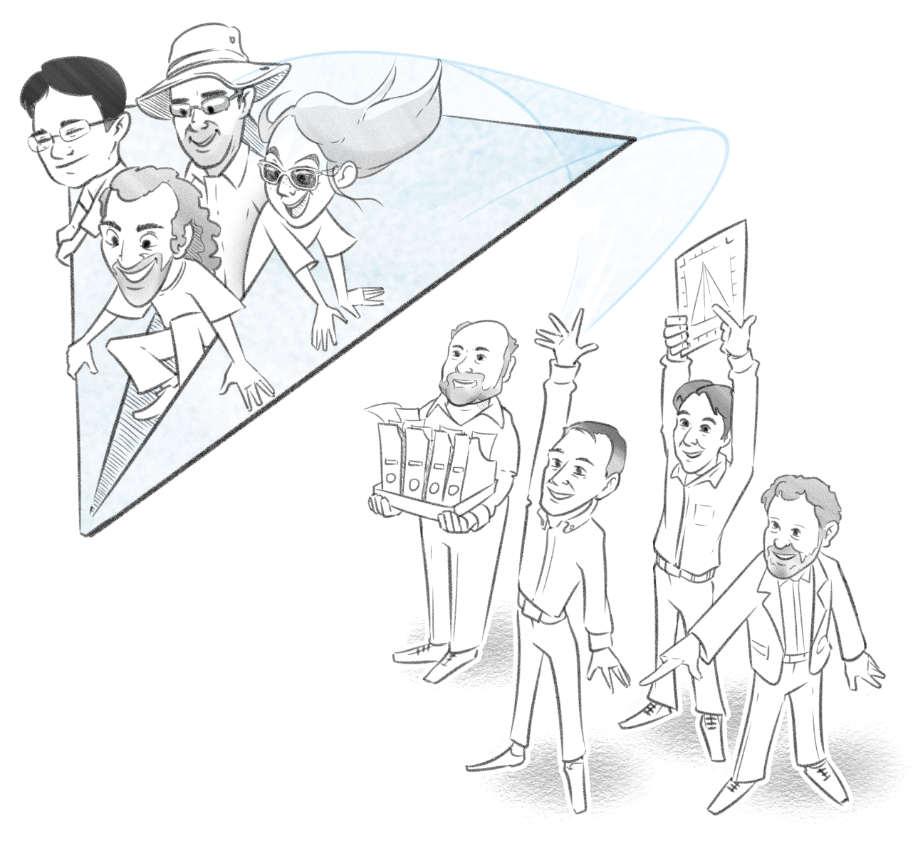

# Analysis and figure code from Dempsey et al. 2020

Redistribution of synapses accompanies memory formation in larval zebrafish
William P. Dempsey, Zhuowei Du, Anna Nadtochiy, Karl Czajkowski, Colton D. Smith,
Andrey Andreev, Drew N. Robson, Jennifer M.B. Li, Serina Applebaum, Thai Truong, Carl
Kesselman, Scott E. Fraser and Don B. Arnold*

  

  cartoon by Roman Papayanov

# Main analysis pipeline
This code performs analysis of the synaptic 3D distribution. It assumes that the pre-processing steps , such as registration, have been done and the parameters, such as deforestation radius and bleaching coefficient, have been chosen (see extra analysis & pre-processing).

Implemented in MATLAB R2018b.
## Import data
**get_data** folder contains the code for importing the data from the .csv that you will get out of the data repository into a convenient structure. Please follow the steps in **ImportCohortData.mlx**
## Data Analysis
**data_analysis** folder contains the code to calculate the DB-plane and get the statistics (number of synapses, fractional gain/loss , median intensity, etc ) on either side of the plane and in the whole pallium. After you have imported the data, please follow the steps in  **db_plane/CalculateDBPlane.mlx** to calculate the DB-planes and then **plane_statistics/GETPlaneStatistics.mlx** to export statistics into excel files.

## Data visualization

**data_vizualization** folder contains the code to visualize synaptic distribution in 3D ( as a point-cloud and voxels), plot DB-planes and manually segmented ROIs on top of the template fish. After you have imported the data and calculated the DB-plane, please follow the steps in **DataVisualization.mlx** to get familiar with all the plotting methods.

This folder also contains a Fiji macro **CsvToPointsAsChannel.ijm** that creates a second channel from the coordinates of the segemnted synapses, to show them on top of raw images in Fiji. To run it you need to create a csv with the synapse coordinates in pixels, use **sbr/SBR_Estimation_and_Simulation_of_LossGain.ipynb** to create one.

# Extra analysis & pre-processing steps
This code registers synaptic point clouds from different fish to the template fish and estimates some coefficients for the subsequent analysis (see main analysis pipeline).

Implemented in MATLAB R2018b and python 3.6.
## Data registration

**registration** folder contains the code for the fish alignment to template based on the 3 landmarks. It takes 3 points in the fish space and in the template space as input and outputs a transformation matrix (rigid + uniform scaling). All the fish have their corresponding transformation in the data repository, so the synaptic point clouds that you can get from the data repository will already be registered into the template space.

## Estimate the number of labeled synapses
To estimate the number of labeled synapses, we compare the brain volume of  7 dpf and 14 dpf zebra fish larvae. **num_labeled\EstimateSynLabeled.mlx** calculates the full brain volume and pallium volume of unlabeled 7 dpf and 14 dpf fish.

## Estimate the deforestation radius
**deforest_rad\EstimateDefRad.mlx**  estimates how much the same synapse moves between the two imaging sessions: before and after the training.

## Estimate bleaching
The intensity of the synapses that are present in both tp1 and tp2 images is redused due to bleaching. **bleaching\EstimateBleaching.mlx** estimates the amount of bleaching in unchanged synapses that happens due to one imaging session.

## Estimate local background and simulate intensity loss/gain
**sbr\SBR_Estimation_and_Simulation_of_LossGain.ipynb** calculates the local background for each synapse, signal to background ratio (sbr) and simulate Intensity Loss/Gain that would have happened due to intensity reduction only. It will also produce a csv with the synapse coordinates in pixels, that you can use with **data_vizualization\CsvToPointsAsChannel.ijm** to have a look at the synapses in the raw images. 

## Spine intensity normalization
**spine_labeling\normalise_robust_scaler.py** This code normalizes the intensity data for fig3 using the Robust Scaler.
